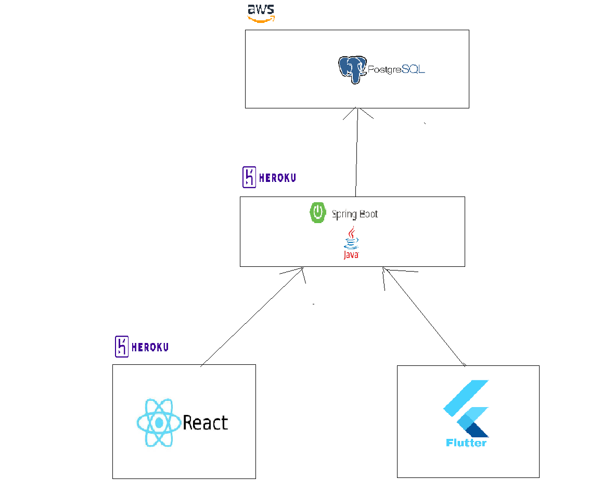
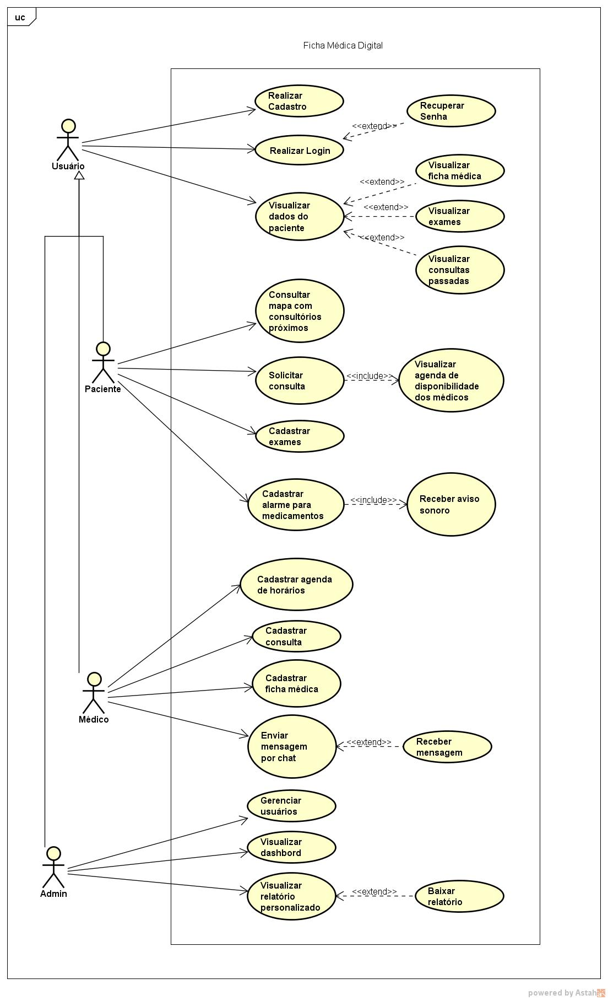
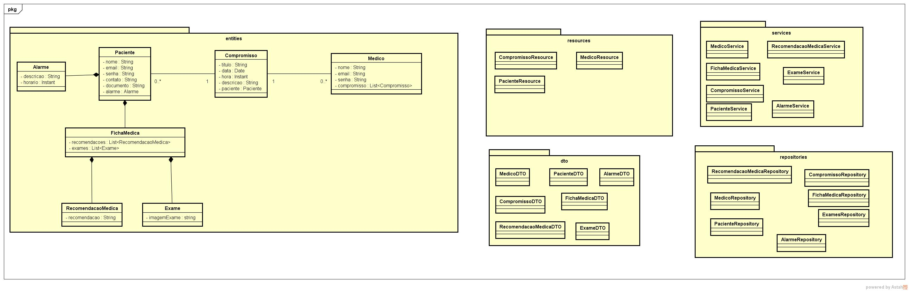
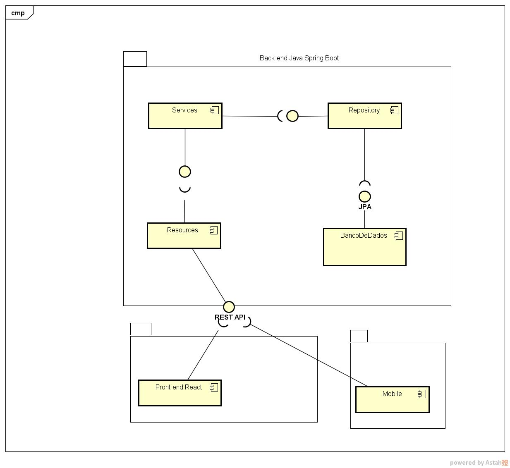

# Ficha Médica Digital

**Anna Laura Reis Dornelas Gama, annalaurard@hotmail.com**

**Edson Júnior Campolina Silva, ejsengsoft@gmail.com**

**João Pedro Mayrink de Jesus, joaopmayrinkj@gmail.com**

**Rodolfo Rocha Rodrigues, rodolforrodrigues14@gmail.com**

---

Professores:

**Cleiton Silva Tavares**

**Jose Laerte Pires Xavier Junior**

---

_Curso de Engenharia de Software, Unidade Praça da Liberdade_

_Instituto de Informática e Ciências Exatas – Pontifícia Universidade de Minas Gerais (PUC MINAS), Belo Horizonte – MG – Brasil_

---

_**Resumo**. O projeto da Ficha Médica Digital tem por principal objetivo fornecer para os médicos e secretárias  um sistema que auxilie na rotina de trabalho desses profissionais nas clínicas, de forma a elevar a qualidade, rapidez e eficiênica das consultas. Além disso, será desenvolvido uma versão mobile que terá funcionalidades importantes para o paciente, principalmente no que refere-se ao registro e consulta de sua ficha médica, que poderá ser compartilhada nas suas consultas. Desse modo, espera-se facilitar o procedimento de cadastro de informações do paciente pelo médico e secretária, visto que esses dados geralmente são os mesmo informados em variadas consultas.

---

## Histórico de Revisões

| **Data** | **Autor** | **Descrição** | **Versão** |
| --- | --- | --- | --- |
| **[23/08/2022]** | [Rodolfo Rocha Rodrigues] | [Iniciando o documento de arquitetura] | [X] |
| **[24/08/2022]** | [Rodolfo Rocha Rodrigues] | [Adicionando descrição do problema e objetivo geral e específico do projeto] | [X] |
| **[25/08/2022]** | [Rodolfo Rocha Rodrigues] | [Adicionando apresentação do projeto] | [X] |
| **[25/08/2022]** | [Rodolfo Rocha Rodrigues] | [Atualizando problema do projeto] | [X] |
| **[25/08/2022]** | [Rodolfo Rocha Rodrigues] | [Adicionando restrições arquiteturais do projeto] | [X] |

## SUMÁRIO

1. [Apresentação](#apresentacao "Apresentação")  
	1.1. Problema  
	1.2. Objetivos do trabalho  
	1.3. Definições e Abreviaturas  

2. [Requisitos](#requisitos "Requisitos")  
'	2.1. Requisitos Funcionais  
	2.2. Requisitos Não-Funcionais  
	2.3. Restrições Arquiteturais  
	2.4. Mecanismos Arquiteturais  

3. [Modelagem](#modelagem "Modelagem e projeto arquitetural")  
	3.1. Visão de Negócio  
	3.2. Visão Lógica  
	3.3. Modelo de dados (opcional)  

4. [Avaliação](#avaliacao "Avaliação da Arquitetura")  
	4.1. Cenários  
	4.2. Avaliação  

5. [Referências](#referencias "REFERÊNCIAS") 

6. [Apêndices](#apendices "APÊNDICES") 

# 1. Apresentação

Atualmente, em um contexto de pandemia e aumento da população adulta e idosa, a demanda por consultas médicas passou por 
um aumento significativo. Esse cenário ocorre, uma vez que, no Brasil, a tendência é o envelhecimento populacional, devido
à alta expectativa de vida e a redução da taxa de natalidade. A partir disso, é notório que a demanda por consultas médicas passou 
por um gradual crescimento, ainda mais se for considerado o fator pós pandemia da covid-19.

Por outra perspectiva, em um mundo globalizado, a demanda pela digitalizaçao é algo presente em diversos setores da sociedade,
incluindo a área da saúde. Nesse sentido, também surge a necessidade de substituir alguns métodos e práticas ultrapassados, por 
ferramentas mais modernas, como por exemplo o uso de uma ficha médica digital, que é de fácil acesso e promove uma convergência de 
informações.

## 1.1. Problema

Considerando esse cenário, a aplicação proposta nesse trabalho almeja solucionar dois principais problemas.O primeiro 
refere-se à redução do tempo de atendimento e espera nos atendimentos médicos, que pode sofrer um aumento devido à alta procura por 
consultas. Já o segundo problema, envolve a descentralização e repetição dos dados do paciente, que possa ocorrer devido à variedade
de médicos que um mesmo paciente possa consultar.

## 1.2. Objetivos do trabalho

1.2.1. Objetivo Geral

A Ficha Médica Digital tem como principal objetivo centralizar as informações mais relevantes do paciente, no que refere-se ao âmbito da saúde, em uma ficha médica digital. Dessa forma, o sistema promoverá tanto para o paciente, quanto para os profissionais de saúde envolvidos,uma maior agilidade, qualidade e experiência no atendimento das consultas.

1.2.2. Objetivos Específicos

1 - Auxiliar os médicos e secretárias de clínicas e hospitais no cadastro da ficha médica do paciente;

2 - Facilitar o acesso do paciente aos seus exames e à sua ficha médica;

3 - Fornecer um mecanismo de agendamento de consulta com base em uma agenda de horários;

## 1.3. Definições e Abreviaturas

Ficha Médica: informações médicas dos pacientes.

Prontuário: documento valioso para o paciente, para o médico que o assiste e para as instituições de saúde, bem como para o ensino, a pesquisa e os serviços públicos de saúde, além de instrumento de defesa legal.

QR-Code: QR, ou "Quick Response", significa "resposta rápida". Os códigos QR são capazes de armazenar muitos dados.

# 2. Requisitos

_Esta seção descreve os requisitos comtemplados nesta descrição arquitetural, divididos em dois grupos: funcionais e não funcionais._

## 2.1. Requisitos Funcionais

| **ID** | **Descrição** | **Prioridade** |
| --- | --- | --- |
| RF001 | Cadastro da ficha médica do paciente| Essencial |
| RF002 | Notificação de mudança de status da consulta para o paciente | Desejável |
| RF003 | Mostrar consultários por especialidade e localização | Desejável |
| RF004 | Marcar consulta | Essencial |
| RF005 | Mostar consultas do paciente | Essencial |
| RF006 | Paciente anexa exame | Essencial |
| RF007 | Paciente visualiza exames | Essencial |
| RF008 | Paciente filtra exames por especialidade| Desejavel |
| RF009 | Visão da ficha médica pelo paciente| Essencial |
| RF010 | Visão da ficha médica pelo médico | Essencial |
| RF011 | Médico visualiza consultas marcadas | Essencial |
| RF012 | Médico aceita ou cancela consultas pendentes | Essencial |
| RF013 | Médico recebe alerta de consulta | Essencial |
| RF014 | Geração de relatório | Desejavel |
| RF015 | Médico preenche dias disponíveis da sua agenda | Desejável |
| RF016 | Administrador cadastra usuarios | Essencial |
| RF017 | Administrador promove usuario a médico | Essencial |
| RF018 | Médico pode cadastrar consulta para paciente | Essencial |
| RF019 | Médico pode cadastrar paciente não cadastrado | Essencial |
| RF020 | Cadastro de usuário | Essencial |
| RF021 | Login de usuário | Essencial |

Obs: acrescente mais linhas, se necessário.

## 2.2. Requisitos Não-Funcionais

| **ID** | **Descrição** |
| --- | --- |
| RNF001 | O sistema web deve ser acessível para resoluções a partir de 1025 pixels de largura, e resoluções mobile até 360 pixels de largura|
| RNF002 | A aplicação para dispositivos móveis deve  ser compatível com smartphones IOS e Android, a partir da versão 6.0 (API nº 23)|

Obs: acrescente mais linhas, se necessário.

## 2.3. Restrições Arquiteturais

- O frontend do software será desenvolvido utilizando a framework React;
- A comunicação da API deverá seguir o padrão RESTful;
- O backend do software será desenvolvido utilizando Java com SpringBoot;
- A versão mobile do software será desenvolvido em Dart/Flutter;
- O serviço de mensageria do software será desenvolvido utilizando a implementação do kafka;
- O sistema será hospedado no Heroku.

## 2.4. Mecanismos Arquiteturais

| **Análise** | **Design** | **Implementação** |
| --- | --- | --- |
| Persistência | Bancos de dados Relacional | PostgreSQL|
| Apresentação | Front end web | React|
| Apresentação | Front end web | Flutter|
| Negócio | Back end | Java|
| Comunicação | API | Rest API|
| Log do sistema | Bancos de dados Relacional | PostgreSQL|
| Teste de Software | Teste | Nativo|
| Acesso externo | Deploy | Heroku|

# 3. Modelagem e projeto arquitetural

**Figura 1 - Visão Geral da Solução  Fonte: o próprio autor**

## 3.1. Visão de Negócio (Funcionalidades)
1. Cadastro da ficha médica do paciente
2. Notificação de mudança de status da consulta para o paciente
3. Mostrar consultários por especialidade e localização 
4. Marcar consulta 
5. Mostar consultas do paciente 
6. Medico anexa exame à consulta do paciente 
7. Paciente visualiza exames 
8. Paciente filtra exames por especialdiade
9. Visão da ficha médica pelo paciente
10. Visão da ficha médica pelo médico 
11. Médico visualiza consultas marcadas 
12. Médico aceita ou cancela consultas pendentes 
13. Médico recebe alerta de consulta 
14. Geração de relatório 
15. Médico preenche dias disponíveis da sua agenda 
16. Médico pode alterar seu perfil
17. Administrador cadastra usuarios 
18. Administrador promove usuario a médico 
19. Médico pode cadastrar consulta para paciente 
20. Médico pode cadastrar paciente não cadastrado 
21. Cadastro de usuário 
22. Login de usuário 
Obs: a quantidade e o escopo das funcionalidades deve ser negociado com os professores/orientadores do trabalho.

### Descrição resumida dos Casos de Uso / Histórias de Usuário

Exemplos de resumo de Casos de Uso:

#### UC01 – Cadastro da ficha médica do paciente

| **Descrição** | Médico vai cadastrar a ficha médica do paciente|
| --- | --- |
| **Atores** | Médico|
| **Prioridade** | Essencial|
| **Requisitos associados** | 1|
| **Fluxo Principal** | 1. Médico entra em cadastrar ficha médica 2. Clica no paciente desejado 3. cadastra a ficha médica|

#### UC02 – Notificação de mudança de status da consulta para o paciente

| **Descrição** | Paciente recebe do sistema uma notificação de mudança do status da consulta|
| --- | --- |
| **Atores** | Paciente|
| **Prioridade** | Desejável|
| **Requisitos associados** | 2,  11, 12, 13, 04|
| **Fluxo Principal** |1. Sistema envia notificação para o paciente quando o status da consulta é alterado|

#### UC03 – Mostrar consultários por especialidade e localização	

| **Descrição** | Paciente vai filtrar pela especialidade dos consultários e ver a localização no mapa|
| --- | --- |
| **Atores** | Paciente|
| **Prioridade** | Desejável|
| **Requisitos associados** | 3|
| **Fluxo Principal** |1. Paciente clica no mapa 2. Paciente aceita usar a localização do dispositivo 3. Paciente filtra por funcionalidade do médico|

#### UC04 – Marcar consulta

| **Descrição** | Paciente marca consulta|
| --- | --- |
| **Atores** | Paciente, Médico|
| **Prioridade** | Essencial|
| **Requisitos associados** | 4|
| **Fluxo Principal** | 1. Paciente escolhe o médico 2. Paciente escolhe a data da consulta 3. Paciente escolhe o horário da consulta 4. Paciente clica em marcar consulta|

#### UC05 – Mostar consultas do paciente

| **Descrição** | Paciente quer ver suas consultas consulta|
| --- | --- |
| **Atores** | Paciente|
| **Prioridade** | Essencial|
| **Requisitos associados** | 4, 5|
| **Fluxo Principal** | 1. Paciente clica em ver consultas 2. filtra por status |

#### UC06 – Paciente anexa exame

| **Descrição** | Paciente anexa exames feitos por ele|
| --- | --- |
| **Atores** | Paciente|
| **Prioridade** | Essencial|
| **Requisitos associados** | 6|
| **Fluxo Principal** | 1.Paciente clica em anexar exames 2. Paciente clica no exame que deseja enviar 3. Clica em Salvar|

#### UC07 – Paciente visualiza exames

| **Descrição** | Paciente quer ver seus exames|
| --- | --- |
| **Atores** | Paciente|
| **Prioridade** | Essencial|
| **Requisitos associados** | 6, 7|
| **Fluxo Principal** | 1.Paciente clica em ver meus exames 2. Paciente clica no exame específico|

#### UC08 – Paciente filtra exames por especialidade

| **Descrição** | Paciente filtra exames por especialidade|
| --- | --- |
| **Atores** | Paciente|
| **Prioridade** | Opcional|
| **Requisitos associados** | 6, 7, 8|
| **Fluxo Principal** | 1. Médico vê as consultas do dia 2. Médico marca como atendido ou não|

#### UC09 – Visão da ficha médica pelo paciente	

| **Descrição** | Paciente ve ficha médica cadastrada pelo médico|
| --- | --- |
| **Atores** | Paciente|
| **Prioridade** | Essencial|
| **Requisitos associados** | 1, 9|
| **Fluxo Principal** | 1. Paciente entra em ficha médica|

#### UC10 – Visão da ficha médica pelo médico

| **Descrição** | Médico ve ficha médica do paciente|
| --- | --- |
| **Atores** | Médico|
| **Prioridade** | Essencial|
| **Requisitos associados** | 1, 10|
| **Fluxo Principal** | 1. Médico clica em fichas médicas 2. Médico escolhe a ficha médica do paciente|

#### UC11 – Médico visualiza consultas marcadas

| **Descrição** | Médico quer ver consultas marcadas|
| --- | --- |
| **Atores** | Médico|
| **Prioridade** | Essencial|
| **Requisitos associados** | 4, 11|
| **Fluxo Principal** | 1.Médico vai em minhas consultas|

#### UC12 – Médico aceita ou cancela consultas pendentes

| **Descrição** | Médico muda status das consultas|
| --- | --- |
| **Atores** | Médico|
| **Prioridade** | Essencial|
| **Requisitos associados** | 4, 11, 12|
| **Fluxo Principal** | 1. Usuário coloca login e senha 2. Usuário clica em login|

#### UC13 – Médico recebe alerta de consulta

| **Descrição** | Sistema alerta médico das consultas criadas|
| --- | --- |
| **Atores** | Sistema, Médico|
| **Prioridade** | Essencial|
| **Requisitos associados** | 4, 13|
| **Fluxo Principal** | 1. Sistema alerta médico das consultas|

#### UC14 – Geração de relatório

| **Descrição** | Gerar relatório|
| --- | --- |
| **Atores** | Admin|
| **Prioridade** | Opcional|
| **Requisitos associados** | 14|
| **Fluxo Principal** | 1. Admin clica no dado desejado 2. cria relatório|

#### UC15 – Médico preenche dias disponíveis da sua agenda

| **Descrição** | Médico preenche dias disponíveis|
| --- | --- |
| **Atores** | Médico|
| **Prioridade** | Desejável|
| **Requisitos associados** | 15|
| **Fluxo Principal** | 1. Médico clica em sua agenda 2. Coloca dias disponiveis|

#### UC16 – Administrador cadastra usuarios

| **Descrição** | Administrador vai cadastrar usuarios|
| --- | --- |
| **Atores** | Admin|
| **Prioridade** | Essencial|
| **Requisitos associados** | 16|
| **Fluxo Principal** | 1. Administrador cadastra usuário|

#### UC17 – Administrador promove usuario a médico

| **Descrição** | Administrador vai promover usuário|
| --- | --- |
| **Atores** | Admin|
| **Prioridade** | Essencial|
| **Requisitos associados** | 16, 17, 20|
| **Fluxo Principal** | 1. Administrador vai promover usuário|

#### UC18 – Médico pode cadastrar consulta para paciente

| **Descrição** | Médico pode cadastrar consulta para paciente|
| --- | --- |
| **Atores** | Médico|
| **Prioridade** | Essencial|
| **Requisitos associados** | 18, 11, 5|
| **Fluxo Principal** | 1. Médico escolhe o usário 2. Médico põe data e horário 3. Médico salva a consulta|

#### UC19 – Médico pode cadastrar paciente não cadastrado

| **Descrição** | Médico pode cadastrar paciente não cadastrado|
| --- | --- |
| **Atores** | Médico|
| **Prioridade** | Essencial|
| **Requisitos associados** | 19|
| **Fluxo Principal** | 1. Médico coloca os cadastros do usuário|

#### UC20 – Cadastro de usuário

| **Descrição** | Usuario faz cadastro no sistema|
| --- | --- |
| **Atores** | Usuário|
| **Prioridade** | Essencial|
| **Requisitos associados** | 20|
| **Fluxo Principal** | 1. Usuário coloca os dados para cadastro 2. usuário salva|

#### UC21 – Login de usuário

| **Descrição** | Usuario faz login no sistema|
| --- | --- |
| **Atores** | Usuárioo|
| **Prioridade** | Essencial|
| **Requisitos associados** | 20, 19|
| **Fluxo Principal** | 1. Usuário coloca login e senha 2. Usuário clica em login|

Exemplos de Histórias de Usuário:

- Como paciente quero cadastrar minha ficha médica
- Como paciente quero consultar consultórios na minha região
- Como paciente quero ser lembrado dos meus médicamentos
- Como paciente quero entrar em contato com os médicos
- Como paciente quero marcar uma consulta
- Como paciente quero ver meus exames
- Como médico quero ver a ficha médica do paciente
- Como médico quero gerenciar minhas consultas
- Como médico quero inserir minha agenda

## 3.2. Visão Lógica

### Diagrama de Classes

**Figura 2 – Diagrama de classes (exemplo). Fonte: o próprio autor.**

Obs: Acrescente uma breve descrição sobre o diagrama apresentado na Figura 3.

### Diagrama de componentes

**Figura 3 – Diagrama de Componentes (exemplo). Fonte: o próprio autor.**

_Apresente uma descrição detalhada dos artefatos que constituem o diagrama de implantação._

Ex: conforme diagrama apresentado na Figura X, as entidades participantes da solução são:

- **Componente 1** - Repository -> Componente responsável por buscar e converter o conteúdo do banco de dados relacional em objetos.
- **Componente 2** - Service -> Componente responsável por tratar os itens que serão trazidos pelo repositório.
- **Componente 3** - Banco de dados -> Componente responsável por armazenar as informações.
- **Componente 4** - Resource -> Componente responsável por tratar as requisições e retornar os itens tratados no Service.
- **Componente 5** - Front-end -> Componente responsável por gerar uma interface web para interagir com os usuários.
- **Componente 6** - Mobile -> Componente responsável por gerar uma interface mobile para interagir com os usuários.

## 3.3. Modelo de dados (opcional)

**Figura 4 – Diagrama de Entidade Relacionamento (ER) - exemplo. Fonte: o próprio autor.**

Obs: Acrescente uma breve descrição sobre o diagrama apresentado na Figura 3.

# 4. Avaliação da Arquitetura

_Esta seção descreve a avaliação da arquitetura apresentada, baseada no método ATAM._

## 4.1. Cenários

_Apresente os cenários de testes utilizados na realização dos testes da sua aplicação. Escolha cenários de testes que demonstrem os requisitos não funcionais sendo satisfeitos. Os requisitos a seguir são apenas exemplos de possíveis requisitos, devendo ser revistos, adequados a cada projeto e complementados de forma a terem uma especificação completa e auto-explicativa._

**Cenário 1 - Acessibilidade:** Suspendisse consequat consectetur velit. Sed sem risus, dictum dictum facilisis vitae, commodo quis leo. Vivamus nulla sem, cursus a mollis quis, interdum at nulla. Nullam dictum congue mauris. Praesent nec nisi hendrerit, ullamcorper tortor non, rutrum sem. In non lectus tortor. Nulla vel tincidunt eros.

**Cenário 2 - Interoperabilidade:** Pellentesque habitant morbi tristique senectus et netus et malesuada fames ac turpis egestas. Fusce ut accumsan erat. Pellentesque in enim tempus, iaculis sem in, semper arcu.

**Cenário 3 - Manutenibilidade:** Phasellus magna tellus, consectetur quis scelerisque eget, ultricies eu ligula. Sed rhoncus fermentum nisi, a ullamcorper leo fringilla id. Nulla lacinia sem vel magna ornare, non tincidunt ipsum rhoncus. Nam euismod semper ante id tristique. Mauris vel elit augue.

**Cenário 4 - Segurança:** Suspendisse consectetur porta tortor non convallis. Sed lobortis erat sed dignissim dignissim. Nunc eleifend elit et aliquet imperdiet. Ut eu quam at lacus tincidunt fringilla eget maximus metus. Praesent finibus, sapien eget molestie porta, neque turpis congue risus, vel porttitor sapien tortor ac nulla. Aliquam erat volutpat.

## 4.2. Avaliação

_Apresente as medidas registradas na coleta de dados. O que não for possível quantificar apresente uma justificativa baseada em evidências qualitativas que suportam o atendimento do requisito não-funcional. Apresente uma avaliação geral da arquitetura indicando os pontos fortes e as limitações da arquitetura proposta._

| **Atributo de Qualidade:** | Segurança |
| --- | --- |
| **Requisito de Qualidade** | Acesso aos recursos restritos deve ser controlado |
| **Preocupação:** | Os acessos de usuários devem ser controlados de forma que cada um tenha acesso apenas aos recursos condizentes as suas credenciais. |
| **Cenários(s):** | Cenário 4 |
| **Ambiente:** | Sistema em operação normal |
| **Estímulo:** | Acesso do administrador do sistema as funcionalidades de cadastro de novos produtos e exclusão de produtos. |
| **Mecanismo:** | O servidor de aplicação (Rails) gera um _token_ de acesso para o usuário que se autentica no sistema. Este _token_ é transferido para a camada de visualização (Angular) após a autenticação e o tratamento visual das funcionalidades podem ser tratados neste nível. |
| **Medida de Resposta:** | As áreas restritas do sistema devem ser disponibilizadas apenas quando há o acesso de usuários credenciados. |

**Considerações sobre a arquitetura:**

| **Riscos:** | Não existe |
| --- | --- |
| **Pontos de Sensibilidade:** | Não existe |
| _ **Tradeoff** _ **:** | Não existe |

Evidências dos testes realizados

_Apresente imagens, descreva os testes de tal forma que se comprove a realização da avaliação._

# 5. REFERÊNCIAS

_Como um projeto da arquitetura de uma aplicação não requer revisão bibliográfica, a inclusão das referências não é obrigatória. No entanto, caso você deseje incluir referências relacionadas às tecnologias, padrões, ou metodologias que serão usadas no seu trabalho, relacione-as de acordo com a ABNT._

Verifique no link abaixo como devem ser as referências no padrão ABNT:

http://www.pucminas.br/imagedb/documento/DOC\_DSC\_NOME\_ARQUI20160217102425.pdf

**[1]** - _ELMASRI, Ramez; NAVATHE, Sham. **Sistemas de banco de dados**. 7. ed. São Paulo: Pearson, c2019. E-book. ISBN 9788543025001._

**[2]** - _COPPIN, Ben. **Inteligência artificial**. Rio de Janeiro, RJ: LTC, c2010. E-book. ISBN 978-85-216-2936-8._

**[3]** - _CORMEN, Thomas H. et al. **Algoritmos: teoria e prática**. Rio de Janeiro, RJ: Elsevier, Campus, c2012. xvi, 926 p. ISBN 9788535236996._

**[4]** - _SUTHERLAND, Jeffrey Victor. **Scrum: a arte de fazer o dobro do trabalho na metade do tempo**. 2. ed. rev. São Paulo, SP: Leya, 2016. 236, [4] p. ISBN 9788544104514._

**[5]** - _RUSSELL, Stuart J.; NORVIG, Peter. **Inteligência artificial**. Rio de Janeiro: Elsevier, c2013. xxi, 988 p. ISBN 9788535237016._

# 6. APÊNDICES

_Inclua o URL do repositório (Github, Bitbucket, etc) onde você armazenou o código da sua prova de conceito/protótipo arquitetural da aplicação como anexos. A inclusão da URL desse repositório de código servirá como base para garantir a autenticidade dos trabalhos._
