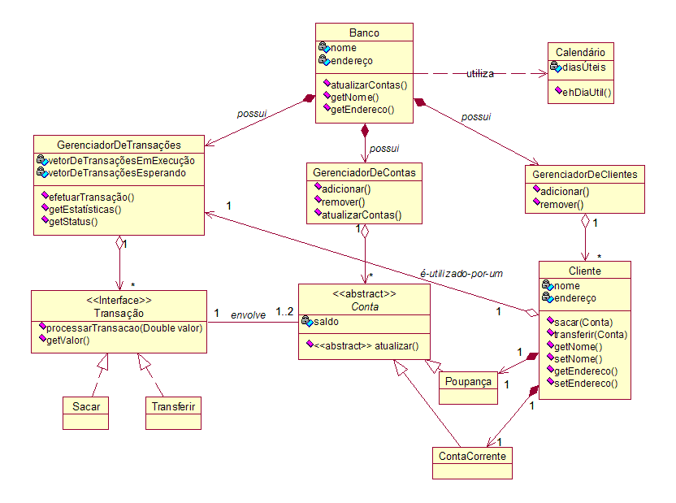

# Ficha Médica Digital

**Anna Laura Reis Dornelas Gama, annalaurard@hotmail.com**

**Edson Júnior Campolina Silva, ejsengsoft@gmail.com**

**João Pedro Mayrink de Jesus, joaopmayrinkj@gmail.com**

**Rodolfo Rocha Rodrigues, rodolforrodrigues14@gmail.com**

---

Professores:

**Cleiton Silva Tavares**

**Jose Laerte Pires Xavier Junior**

---

_Curso de Engenharia de Software, Unidade Praça da Liberdade_

_Instituto de Informática e Ciências Exatas – Pontifícia Universidade de Minas Gerais (PUC MINAS), Belo Horizonte – MG – Brasil_

---

_**Resumo**. O projeto da Ficha Médica Digital tem por principal objetivo fornecer para os médicos e secretárias  um sistema que auxilie na rotina de trabalho desses profissionais nas clínicas, de forma a elevar a qualidade, rapidez e eficiênica das consultas. Além disso, será desenvolvido uma versão mobile que terá funcionalidades importantes para o paciente, principalmente no que refere-se ao registro e consulta de sua ficha médica, que poderá ser compartilhada nas suas consultas. Desse modo, espera-se facilitar o procedimento de cadastro de informações do paciente pelo médico e secretária, visto que esses dados geralmente são os mesmo informados em variadas consultas.

---

## Histórico de Revisões

| **Data** | **Autor** | **Descrição** | **Versão** |
| --- | --- | --- | --- |
| **[23/08/2022]** | [Rodolfo Rocha Rodrigues] | [Iniciando o documento de arquitetura] | [X] |
| **[24/08/2022]** | [Rodolfo Rocha Rodrigues] | [Adicionando descrição do problema e objetivo geral e específico do projeto] | [X] |
| **[25/08/2022]** | [Rodolfo Rocha Rodrigues] | [Adicionando apresentação do projeto] | [X] |
| **[25/08/2022]** | [Rodolfo Rocha Rodrigues] | [Atualizando problema do projeto] | [X] |

## SUMÁRIO

1. [Apresentação](#apresentacao "Apresentação")  
	1.1. Problema  
	1.2. Objetivos do trabalho  
	1.3. Definições e Abreviaturas  

2. [Requisitos](#requisitos "Requisitos")  
'	2.1. Requisitos Funcionais  
	2.2. Requisitos Não-Funcionais  
	2.3. Restrições Arquiteturais  
	2.4. Mecanismos Arquiteturais  

3. [Modelagem](#modelagem "Modelagem e projeto arquitetural")  
	3.1. Visão de Negócio  
	3.2. Visão Lógica  
	3.3. Modelo de dados (opcional)  

4. [Avaliação](#avaliacao "Avaliação da Arquitetura")  
	4.1. Cenários  
	4.2. Avaliação  

5. [Referências](#referencias "REFERÊNCIAS") 

6. [Apêndices](#apendices "APÊNDICES") 

# 1. Apresentação

Atualmente, em um contexto de pandemia e aumento da população adulta e idosa, a demanda por consultas médicas passou por 
um aumento significativo. Esse cenário ocorre, uma vez que, no Brasil, a tendência é o envelhecimento populacional, devido
à alta expectativa de vida e a redução da taxa de natalidade. A partir disso, é notório que a demanda por consultas médicas passou 
por um gradual crescimento, ainda mais se for considerado o fator pós pandemia da covid-19.

Por outra perspectiva, em um mundo globalizado, a demanda pela digitalizaçao é algo presente em diversos setores da sociedade,
incluindo a área da saúde. Nesse sentido, também surge a necessidade de substituir alguns métodos e práticas ultrapassados, por 
ferramentas mais modernas, como por exemplo o uso de uma ficha médica digital, que é de fácil acesso e promove uma convergência de 
informações.

## 1.1. Problema

Considerando esse cenário, a aplicação proposta nesse trabalho almeja solucionar dois principais problemas.O primeiro 
refere-se à redução do tempo de atendimento e espera nos atendimentos médicos, que pode sofrer um aumento devido à alta procura por 
consultas. Já o segundo problema, envolve a descentralização e repetição dos dados do paciente, que possa ocorrer devido à variedade
de médicos que um mesmo paciente possa consultar.

## 1.2. Objetivos do trabalho

1.2.1. Objetivo Geral

A Ficha Médica Digital tem como principal objetivo centralizar as informações mais relevantes do paciente, no que refere-se ao âmbito da saúde, em uma ficha médica digital. Dessa forma, o sistema promoverá tanto para o paciente, quanto para os profissionais de saúde envolvidos,uma maior agilidade, qualidade e experiência no atendimento das consultas.

1.2.2. Objetivos Específicos

1 - Auxiliar os médicos e secretárias de clínicas e hospitais no cadastro da ficha médica do paciente;

2 - Facilitar o acesso do paciente aos seus exames e à sua ficha médica;

3 - Fornecer um mecanismo de agendamento de consulta com base em uma agenda de horários;

## 1.3. Definições e Abreviaturas

Ficha Médica: informações médicas dos pacientes.

Prontuário: documento valioso para o paciente, para o médico que o assiste e para as instituições de saúde, bem como para o ensino, a pesquisa e os serviços públicos de saúde, além de instrumento de defesa legal.

QR-Code: QR, ou "Quick Response", significa "resposta rápida". Os códigos QR são capazes de armazenar muitos dados.

# 2. Requisitos

_Esta seção descreve os requisitos comtemplados nesta descrição arquitetural, divididos em dois grupos: funcionais e não funcionais._

## 2.1. Requisitos Funcionais

_Enumere os requisitos funcionais previstos para a sua aplicação. Concentre-se nos requisitos funcionais que sejam críticos para a definição arquitetural. Lembre-se de listar todos os requisitos que são necessários para garantir cobertura arquitetural. Esta seção deve conter uma lista de requisitos ainda sem modelagem. Na coluna Prioridade utilize uma escala (do mais prioritário para o menos): Essencial, Desejável, Opcional._

| **ID** | **Descrição** | **Prioridade** |
| --- | --- | --- |
| RF001 | | |
| RF002 | | |
| | | |
| | | |
| | | |

Obs: acrescente mais linhas, se necessário.

## 2.2. Requisitos Não-Funcionais

_Enumere os requisitos não-funcionais previstos para a sua aplicação. Entre os requisitos não funcionais, inclua todos os requisitos que julgar importante do ponto de vista arquitetural ou seja os requisitos que terão impacto na definição da arquitetura. Os requisitos devem ser descritos de forma completa e preferencialmente quantitativa._

| **ID** | **Descrição** |
| --- | --- |
| RNF001 | |
| RNF002 | |
| | |
| | |
| | |

Obs: acrescente mais linhas, se necessário.

## 2.3. Restrições Arquiteturais

_Enumere as restrições arquiteturais. Lembre-se de que as restrições arquiteturais geralmente não são consideradas requisitos uma vez que limitam a solução candidata. Os requisitos não impõem restrição, mas precisam ser satisfeitos._

As restrições impostas ao projeto que afetam sua arquitetura são (por exemplo):

- O software deverá ser desenvolvido em Python/Django;
- A comunicação da API deve seguir o padrão RESTful.

## 2.4. Mecanismos Arquiteturais

_Visão geral dos mecanismos que compõem a arquitetura do sosftware baseando-se em três estados: (1) análise, (2) design e (3) implementação. Em termos de Análise devem ser listados os aspectos gerais que compõem a arquitetura do software como: persistência, integração com sistemas legados, geração de logs do sistema, ambiente de front end, tratamento de exceções, formato dos testes, formato de distribuição/implantação (deploy), entre outros. Em Design deve-se identificar o padrão tecnológico a seguir para cada mecanismo identificado na análise. Em Implementação, deve-se identificar o produto a ser utilizado na solução.
 Ex: Análise (Persistência), Design (ORM), Implementação (Hibernate)._

| **Análise** | **Design** | **Implementação** |
| --- | --- | --- |
| Persistência | | |
| Front end | | |
| Back end | | |
| Integração | | |
| Log do sistema | | |
| Teste de Software | | |
| Deploy | | |

# 3. Modelagem e projeto arquitetural

_Apresente uma visão geral da solução proposta para o projeto e explique brevemente esse diagrama de visão geral, de forma textual. Esse diagrama não precisa seguir os padrões da UML, e deve ser completo e tão simples quanto possível, apresentando a macroarquitetura da solução._

**Figura 1 - Visão Geral da Solução (fonte: https://medium.com)**

Obs: substitua esta imagem por outra, adequada ao seu projeto (cada arquitetura é única).

## 3.1. Visão de Negócio (Funcionalidades)

_Apresente uma lista simples com as funcionalidades previstas no projeto (escopo do produto)._

1. O sistema deve...
2. O sistema deve...
3. ...

Obs: a quantidade e o escopo das funcionalidades deve ser negociado com os professores/orientadores do trabalho.

### Descrição resumida dos Casos de Uso / Histórias de Usuário

_Nesta seção, os casos de uso devem ser resumidos. Esse detalhamento pode ser na forma de um texto sintético ou, alternativamente, você pode optar por descrever estórias de usuários seguindo os métodos ágeis. Neste caso a seção deve chamar &quot;Histórias de usuários&quot;. Lembre-se das características de qualidade das estórias de usuários, ou seja, o que é preciso para descrever boas histórias de usuários._

Exemplos de resumo de Casos de Uso:

#### UC01 – NOME DO CASO DE USO 01

| **Descrição** | |
| --- | --- |
| **Atores** | |
| **Prioridade** | |
| **Requisitos associados** | |
| **Fluxo Principal** | |

#### UC02 – NOME DO CASO DE USO 02

| **Descrição** | |
| --- | --- |
| **Atores** | |
| **Prioridade** | |
| **Requisitos associados** | |
| **Fluxo Principal** | |

Exemplos de Histórias de Usuário:

- Como Fulano eu quero poder convidar meus amigos para que a gente possa se reunir...

- Como Cicrano eu quero poder organizar minhas tarefas diárias, para que...

- Como gerente eu quero conseguir entender o progresso do trabalho do meu time, para que eu possa ter relatórios periódicos dos nossos acertos e falhas.

## 3.2. Visão Lógica

_Apresente os artefatos que serão utilizados descrevendo em linhas gerais as motivações que levaram a equipe a utilizar estes diagramas._

### Diagrama de Classes

**Figura 2 – Diagrama de classes (exemplo). Fonte: o próprio autor.**

Obs: Acrescente uma breve descrição sobre o diagrama apresentado na Figura 3.

### Diagrama de componentes

_Apresente o diagrama de componentes da aplicação, indicando, os elementos da arquitetura e as interfaces entre eles. Liste os estilos/padrões arquiteturais utilizados e faça uma descrição sucinta dos componentes indicando o papel de cada um deles dentro da arquitetura/estilo/padrão arquitetural. Indique também quais componentes serão reutilizados (navegadores, SGBDs, middlewares, etc), quais componentes serão adquiridos por serem proprietários e quais componentes precisam ser desenvolvidos._

**Figura 3 – Diagrama de Componentes (exemplo). Fonte: o próprio autor.**

_Apresente uma descrição detalhada dos artefatos que constituem o diagrama de implantação._

Ex: conforme diagrama apresentado na Figura X, as entidades participantes da solução são:

- **Componente 1** - Lorem ipsum dolor sit amet, consectetur adipiscing elit. Cras nunc magna, accumsan eget porta a, tincidunt sed mauris. Suspendisse orci nulla, sagittis a lorem laoreet, tincidunt imperdiet ipsum. Morbi malesuada pretium suscipit.
- **Componente 2** - Praesent nec nisi hendrerit, ullamcorper tortor non, rutrum sem. In non lectus tortor. Nulla vel tincidunt eros.

## 3.3. Modelo de dados (opcional)

_Caso julgue necessário para explicar a arquitetura, apresente o diagrama de classes ou diagrama de Entidade/Relacionamentos ou tabelas do banco de dados. Este modelo pode ser essencial caso a arquitetura utilize uma solução de banco de dados distribuídos ou um banco NoSQL._

 ")

**Figura 4 – Diagrama de Entidade Relacionamento (ER) - exemplo. Fonte: o próprio autor.**

Obs: Acrescente uma breve descrição sobre o diagrama apresentado na Figura 3.

# 4. Avaliação da Arquitetura

_Esta seção descreve a avaliação da arquitetura apresentada, baseada no método ATAM._

## 4.1. Cenários

_Apresente os cenários de testes utilizados na realização dos testes da sua aplicação. Escolha cenários de testes que demonstrem os requisitos não funcionais sendo satisfeitos. Os requisitos a seguir são apenas exemplos de possíveis requisitos, devendo ser revistos, adequados a cada projeto e complementados de forma a terem uma especificação completa e auto-explicativa._

**Cenário 1 - Acessibilidade:** Suspendisse consequat consectetur velit. Sed sem risus, dictum dictum facilisis vitae, commodo quis leo. Vivamus nulla sem, cursus a mollis quis, interdum at nulla. Nullam dictum congue mauris. Praesent nec nisi hendrerit, ullamcorper tortor non, rutrum sem. In non lectus tortor. Nulla vel tincidunt eros.

**Cenário 2 - Interoperabilidade:** Pellentesque habitant morbi tristique senectus et netus et malesuada fames ac turpis egestas. Fusce ut accumsan erat. Pellentesque in enim tempus, iaculis sem in, semper arcu.

**Cenário 3 - Manutenibilidade:** Phasellus magna tellus, consectetur quis scelerisque eget, ultricies eu ligula. Sed rhoncus fermentum nisi, a ullamcorper leo fringilla id. Nulla lacinia sem vel magna ornare, non tincidunt ipsum rhoncus. Nam euismod semper ante id tristique. Mauris vel elit augue.

**Cenário 4 - Segurança:** Suspendisse consectetur porta tortor non convallis. Sed lobortis erat sed dignissim dignissim. Nunc eleifend elit et aliquet imperdiet. Ut eu quam at lacus tincidunt fringilla eget maximus metus. Praesent finibus, sapien eget molestie porta, neque turpis congue risus, vel porttitor sapien tortor ac nulla. Aliquam erat volutpat.

## 4.2. Avaliação

_Apresente as medidas registradas na coleta de dados. O que não for possível quantificar apresente uma justificativa baseada em evidências qualitativas que suportam o atendimento do requisito não-funcional. Apresente uma avaliação geral da arquitetura indicando os pontos fortes e as limitações da arquitetura proposta._

| **Atributo de Qualidade:** | Segurança |
| --- | --- |
| **Requisito de Qualidade** | Acesso aos recursos restritos deve ser controlado |
| **Preocupação:** | Os acessos de usuários devem ser controlados de forma que cada um tenha acesso apenas aos recursos condizentes as suas credenciais. |
| **Cenários(s):** | Cenário 4 |
| **Ambiente:** | Sistema em operação normal |
| **Estímulo:** | Acesso do administrador do sistema as funcionalidades de cadastro de novos produtos e exclusão de produtos. |
| **Mecanismo:** | O servidor de aplicação (Rails) gera um _token_ de acesso para o usuário que se autentica no sistema. Este _token_ é transferido para a camada de visualização (Angular) após a autenticação e o tratamento visual das funcionalidades podem ser tratados neste nível. |
| **Medida de Resposta:** | As áreas restritas do sistema devem ser disponibilizadas apenas quando há o acesso de usuários credenciados. |

**Considerações sobre a arquitetura:**

| **Riscos:** | Não existe |
| --- | --- |
| **Pontos de Sensibilidade:** | Não existe |
| _ **Tradeoff** _ **:** | Não existe |

Evidências dos testes realizados

_Apresente imagens, descreva os testes de tal forma que se comprove a realização da avaliação._

# 5. REFERÊNCIAS

_Como um projeto da arquitetura de uma aplicação não requer revisão bibliográfica, a inclusão das referências não é obrigatória. No entanto, caso você deseje incluir referências relacionadas às tecnologias, padrões, ou metodologias que serão usadas no seu trabalho, relacione-as de acordo com a ABNT._

Verifique no link abaixo como devem ser as referências no padrão ABNT:

http://www.pucminas.br/imagedb/documento/DOC\_DSC\_NOME\_ARQUI20160217102425.pdf

**[1]** - _ELMASRI, Ramez; NAVATHE, Sham. **Sistemas de banco de dados**. 7. ed. São Paulo: Pearson, c2019. E-book. ISBN 9788543025001._

**[2]** - _COPPIN, Ben. **Inteligência artificial**. Rio de Janeiro, RJ: LTC, c2010. E-book. ISBN 978-85-216-2936-8._

**[3]** - _CORMEN, Thomas H. et al. **Algoritmos: teoria e prática**. Rio de Janeiro, RJ: Elsevier, Campus, c2012. xvi, 926 p. ISBN 9788535236996._

**[4]** - _SUTHERLAND, Jeffrey Victor. **Scrum: a arte de fazer o dobro do trabalho na metade do tempo**. 2. ed. rev. São Paulo, SP: Leya, 2016. 236, [4] p. ISBN 9788544104514._

**[5]** - _RUSSELL, Stuart J.; NORVIG, Peter. **Inteligência artificial**. Rio de Janeiro: Elsevier, c2013. xxi, 988 p. ISBN 9788535237016._

# 6. APÊNDICES

_Inclua o URL do repositório (Github, Bitbucket, etc) onde você armazenou o código da sua prova de conceito/protótipo arquitetural da aplicação como anexos. A inclusão da URL desse repositório de código servirá como base para garantir a autenticidade dos trabalhos._
